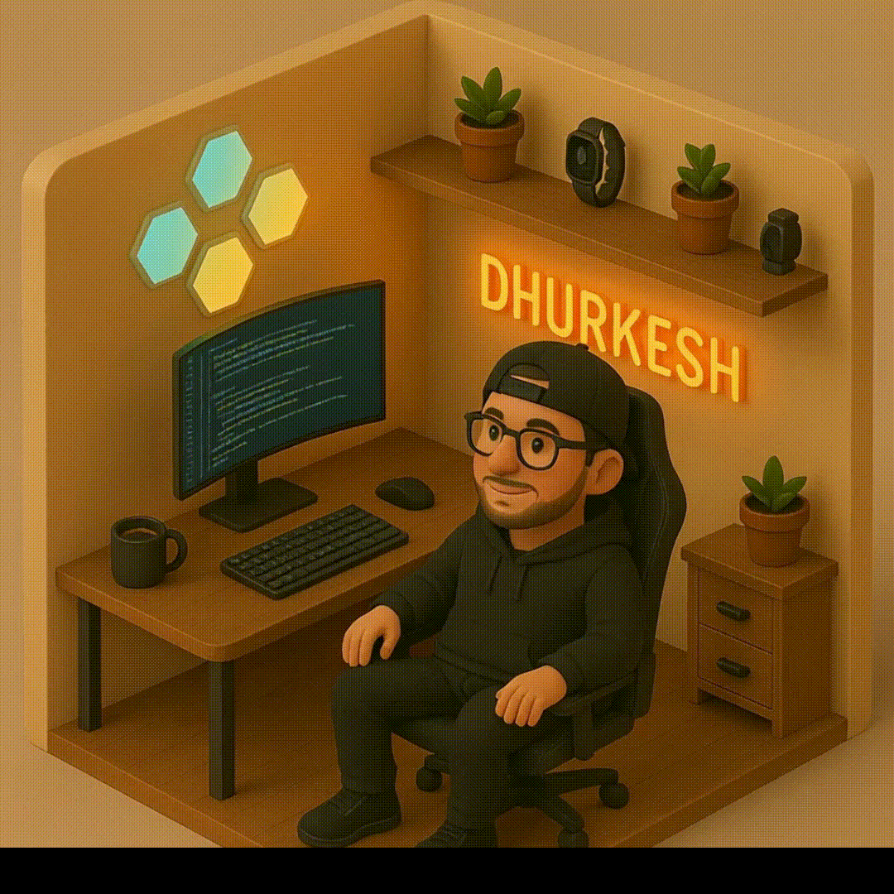

###

  
  
  
    

###

<h3 align="center">About Me</h3>

  

###

  

<h3 align="left">🛠 Language and tools</h3>

###

  
  
  
  
  
  
  
  
  
  
  
  
  
  
  

  

  
  
  
  
  
  
  
  
  
  
  
  
  
  
  
  
  
  
  
  
  

##

<h3 align="left">🔥   My Stats :</h3>

###

  

###

  
  

##

<h3 align="left">⭐   LeetCode :</h3>

###

  

###

### 3D Contribution Chart

  

###
